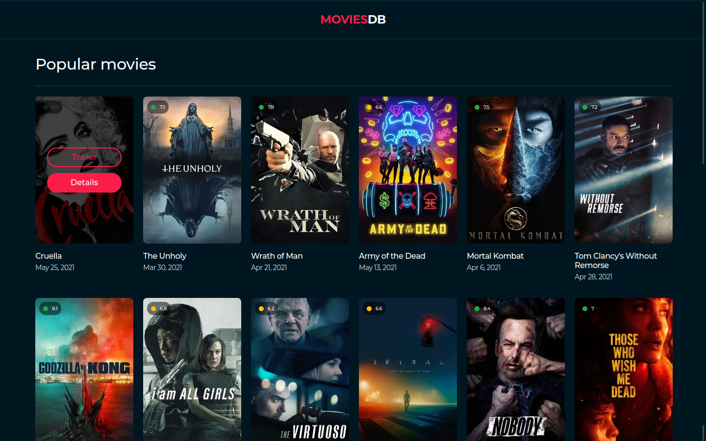
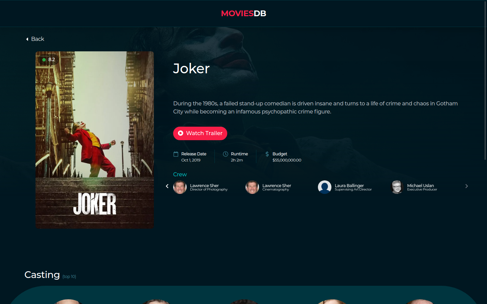

# MoviesDB

A nice webapp to list the most popular movies, it's helpful to find something to watch when you have no idea.

## It's alive

[https://moviesdb-e.vercel.app/](https://moviesdb-e.vercel.app/)

## Screenshots





## About the project

This project is based on [MoviesDB Layout](./info/layout.xd), designed by [Luan Santos](https://github.com/luankjs).

Some test criteria should be considered:

- Should use a javascript framework
- Should use Sass
- Should use Bootstrap
- Should use The Movies DB API

## Stack

- [React](https://reactjs.org/)
- [Next.js](https://nextjs.org)
- [Sass](https://sass-lang.com)
- [Bootstrap v5](https://getbootstrap.com/)
- [The Movie DB API](https://www.themoviedb.org/)

## Getting Started

1. Clone the repository

```bash
git clone https://github.com/endopedro/moviesdb.git
```

2. Then create and fill the .env file (based on .env.example) with your TMDB credentials and app informations.

3. Install dependencies

```bash
yarn
```

4. Fire up the server and watch files

```bash
yarn dev
```

5. Go to the address [http://localhost:3000/](http://localhost:3000/)
